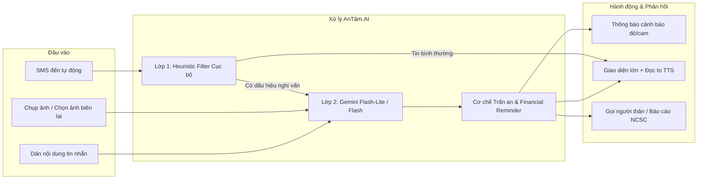

# 🛡️ AnTâm.AI — Trợ Thủ AI Phòng Chống Lừa Đảo Trực Tuyến

<div align="center">

[](https://github.com)
[-3DDC84?style=for-the-badge&logo=android)](https://www.android.com)
[](https://ai.google.dev)
[](https://developer.android.com/jetpack/compose)
[](file:///d:/Projects/AnTamAI/AnTamAI-Test-Plan.md)

*Đóng vai "người con am hiểu công nghệ" luôn bên cạnh cha mẹ và người dùng, bảo vệ chủ động trước các thủ đoạn lừa đảo tinh vi tại Việt Nam.*

</div>

---

## 📌 Mục lục
- [1. Vấn đề thực tế](#1-vấn-đề-muốn-giải-quyết)
- [2. Tổng quan giải pháp AnTâm.AI](#2-tổng-quan-giải-pháp)
- [3. Công nghệ Google tích hợp](#3-công-nghệ-google-đã-tích-hợp)
- [4. Điểm độc đáo & Khác biệt cốt lõi](#4-điểm-độc-đáo--khác-biệt-cốt-lõi)
- [5. Bằng chứng kiểm thử & Tương tác người dùng](#5-bằng-chứng-tương-tác-người-dùng)
- [6. Kiến trúc hệ thống](#6-kiến-trúc-kỹ-thuật)
- [7. Hướng dẫn cài đặt & Chạy ứng dụng](#7-hướng-dẫn-cài-đặt--chạy-dự-án)
- [8. Kế hoạch phát triển tương lai](#8-kế-hoạch-phát-triển-tương-lai)

---

## 1. Vấn đề muốn giải quyết

Tại Việt Nam, các hình thức **lừa đảo trực tuyến qua tin nhắn SMS, mạng xã hội và hình ảnh** đang bùng nổ với tốc độ chóng mặt, gây thiệt hại hàng nghìn tỷ đồng mỗi năm. Kịch bản lừa đảo biến hóa liên tục:
- **Giả danh cơ quan công quyền:** Thông báo vi phạm giao thông (phạt nguội), lệnh bắt giam tạm thời, truy thu thuế.
- **Mạo danh ngân hàng / cổng thanh toán:** Cảnh báo khóa tài khoản, yêu cầu xác thực qua link lạ, cung cấp mã OTP.
- **Biên lai chuyển khoản giả:** Đánh vào tâm lý người bán hàng online để chiếm đoạt tài sản.
- **Trúng thưởng / Quà tri ân:** Mời gọi bấm vào đường link độc hại, rút gọn.

### 🔴 Điểm nghẽn của các giải pháp hiện tại:
1. **Nạn nhân yếu thế:** Người lớn tuổi, người nội trợ, lao động phổ thông dễ hoảng loạn khi nhận tin đe dọa, thiếu kỹ năng tra cứu công nghệ kịp thời.
2. **Cảnh báo khô khan & bị động:** Hầu hết công cụ hiện nay chỉ đưa ra chỉ số kỹ thuật khó hiểu (*"Risk Score 85%"*, *"Domain không an toàn"*), không giải thích bằng lời lẽ dễ hiểu và mang tính bị động (người dùng phải tự nghi ngờ rồi mới copy đi tra cứu).
3. **Thiếu sự trấn an:** Nạn nhân khi hoảng sợ cần nhất là lời khuyên bình tĩnh và các bước xử lý cụ thể, rõ ràng từng bước.

---

## 2. Tổng quan giải pháp

**AnTâm.AI** là ứng dụng Android bản địa (Native Kotlin + Jetpack Compose) tích hợp **Google Gemini API đa phương thức (Vision + Text)**, đóng vai trò như một *"người con am hiểu công nghệ"* luôn kề cận để bảo vệ và trấn an người dùng.



### Ứng dụng gồm 2 luồng hoạt động chính:

1. **Kiểm tra chủ động (Tab "Kiểm tra"):**
   - Chụp hoặc tải ảnh màn hình (biên lai chuyển tiền, bài đăng, website giả mạo) hoặc dán tin nhắn nghi vấn.
   - AI phân tích đa phương thức và giải thích bằng ngôn ngữ đời thường, liệt kê tối đa 3 dấu hiệu cốt lõi, đưa ra lời nhắc dứt khoát và hotline chính thức nếu có.

2. **Bảo vệ tự động 24/7 (Tab "SMS"):**
   - Tự động quét tin nhắn SMS mới đến ngay cả khi ứng dụng đã đóng hoàn toàn (Background Worker, không cần làm app SMS mặc định).
   - **Kiến trúc lọc 2 lớp:** Bộ lọc Heuristic cục bộ loại bỏ tin nhắn an toàn/khuyến mãi viễn thông tức thì, chỉ gọi Gemini API đối với các tin nhắn có dấu hiệu đáng ngờ.
   - Bắn thông báo cảnh báo bảo mật (`VISIBILITY_PRIVATE`) bảo vệ người dùng ngay lập tức.

---

## 3. Công nghệ Google đã tích hợp

| Công nghệ Google | Vai trò trong AnTâm.AI |
|---|---|
| **Google Gemini 3.5 Flash** | Phân tích đa phương thức chuyên sâu (Multimodal: Vision + Text) cho ảnh biên lai chuyển khoản, ảnh chụp website giả mạo và kiểm tra thủ công. |
| **Google Gemini 3.1 Flash-Lite** | Quét nhanh SMS nền với độ trễ cực thấp, tối ưu chi phí và phản hồi thời gian thực khi có tin nhắn đến. |
| **Google Secrets Gradle Plugin** | Quản lý bảo mật `GEMINI_API_KEY` an toàn qua biến môi trường (`.env`), không hardcode trong mã nguồn, truyền qua HTTP Header `x-goog-api-key`. |
| **Jetpack Compose & Material 3** | Xây dựng giao diện hiện đại, độ tương phản cao, phông chữ lớn, dễ thao tác cho người lớn tuổi. |
| **Android WorkManager & Room** | Quản lý tác vụ chạy nền định kỳ/sự kiện với chính sách Exponential Backoff và lưu trữ nhật ký phân tích offline an toàn. |
| **Android Text-To-Speech (TTS)** | Tích hợp giọng đọc trợ lý tiếng Việt, hỗ trợ đọc to kết quả cho người khiếm thị hoặc người cao tuổi mắt kém. |

---

## 4. Điểm độc đáo & Khác biệt cốt lõi

### 🎯 1. Hiệu chỉnh chống "nhờn" cảnh báo (False Positive Calibration)
Hệ thống được tinh chỉnh để cân bằng hoàn hảo giữa việc **không bỏ sót lừa đảo tinh vi** và **không cảnh báo nhầm**. 
- Các tin nhắn khuyến mãi viễn thông chứa cú pháp thời hạn như *"trong 24 giờ tới"*, *"trong 3 ngày"* nhưng **không đi kèm đe dọa hậu quả hoặc yêu cầu tài chính** sẽ không bị gắn cờ nhầm.

### 💳 2. Khối Lưu ý Tài chính Bắt buộc ("Nguyên tắc vàng cho ảnh biên lai")
Đối với mọi ảnh biên lai chuyển tiền/giao dịch ngân hàng, bất kể AI đánh giá ảnh có vẻ thật hay không, hệ thống **luôn hiển thị khối nhắc nhở cố định**:
> *"Nguyên tắc vàng: Bạn hãy tự mở ứng dụng ngân hàng của mình lên. Chỉ khi nào thấy số dư thực tế tăng lên thì giao dịch mới thực sự an toàn."*
> 
> *(Giải quyết triệt để kịch bản lừa đảo làm giả biên lai chuyển khoản nhằm chiếm đoạt hàng hóa của người bán hàng online).*

### 🗣️ 3. Ngôn ngữ ân cần & Trấn an tâm lý
- Không dùng thuật ngữ kỹ thuật khô khan.
- Mở đầu phản hồi luôn là lời trấn an giúp người dùng lấy lại bình tĩnh trước khi đưa ra hướng dẫn xử lý.
- Hỗ trợ nút **"Đọc to kết quả"** bằng giọng nói tự nhiên.

### 🤝 4. Mạng lưới bảo vệ liên kết
- **Báo cáo NCSC:** Tích hợp nút báo cáo 1 chạm dẫn tới Cổng cảnh báo an toàn không gian mạng quốc gia (`canhbao.ncsc.gov.vn` — Cục An toàn thông tin, Bộ Thông tin và Truyền thông).
- **Gọi nhanh người thân:** Lưu số điện thoại con cháu/người thân tin cậy để gọi xin ý kiến khẩn cấp chỉ với một nút bấm.
- **Thống kê bảo vệ:** Hiển thị huy hiệu *"Đã bảo vệ bạn X lần"* tạo sự an tâm và gắn kết lâu dài.

---

## 5. Bằng chứng tương tác người dùng

Trong quá trình phát triển sản phẩm trong khuôn khổ **AI Riser Vietnam 2026**:

1. **Kiểm thử trên tập dữ liệu thực tế:** Nhóm đã xây dựng và kiểm thử liên tục với **hơn 20 bộ kịch bản lừa đảo thực tế** phổ biến tại Việt Nam (giả danh cơ quan công an, phạt nguội giao thông, giả mạo website ngân hàng, lừa đảo trúng thưởng xe máy, giữ kiện hàng bưu cục, biên lai chuyển khoản chỉnh sửa số dư).
2. **Thử nghiệm trực tiếp với người dùng mục tiêu:** Nhóm đã mời trực tiếp người thân trong gia đình (cha mẹ, người cao tuổi ít tiếp xúc công nghệ) dùng thử để kiểm tra:
   - Mức độ dễ hiểu của câu chữ và mức độ trấn an của AI khi gặp tình huống giả định.
   - Khả năng thao tác với cỡ chữ lớn và tính năng đọc to giọng nói.
   - Phản hồi cho thấy người dùng lớn tuổi cảm thấy bớt hoảng sợ và biết chính xác mình "không nên làm gì" (không bấm link, không chuyển tiền).
3. **Độ tin cậy mã nguồn (Automated Tests):** 
   - Đạt **100% PASS trên 24/24 Unit Test cases** kiểm tra toàn bộ logic Heuristic, bóc tách JSON, map Enum trạng thái và bảo vệ API Key.

---

## 6. Kiến trúc kỹ thuật

```
com.example/
├── data/
│   ├── local/              # Room Database, SmsEntity, SmsDao
│   ├── model/              # GeminiRequest, GeminiResponse, ScamAnalysisResult
│   ├── remote/             # ApiClient, GeminiApiService (Retrofit + Moshi)
│   └── repository/         # ScamAnalysisRepository, SmsRepository, SettingsRepository
├── receiver/
│   └── SmsReceiver.kt      # BroadcastReceiver bắt tin nhắn SMS đến tức thì
├── worker/
│   └── SmsAnalysisWorker.kt# WorkManager xử lý quét nền & phân tích AI
├── ui/
│   ├── components/         # AppTabHeader, ActionButtons
│   ├── screens/            # HomeScreen, ResultScreen, SmsInboxScreen, SettingsScreen
│   ├── theme/              # Bảng màu Trust Blue & Slate độ tương phản cao
│   └── viewmodel/          # MainViewModel (StateFlow & MVI Pattern)
└── util/
    ├── AppConstants.kt     # Hằng số, Enum trạng thái an toàn
    ├── HeuristicFilter.kt  # Bộ lọc từ khóa & biểu thức chính quy cục bộ
    ├── JsonUtils.kt        # Bóc tách JSON an toàn & lọc Markdown code fence
    ├── NotificationHelper.kt# Quản lý kênh thông báo an toàn (Lockscreen Privacy)
    └── TextToSpeechHelper.kt# Xử lý đọc to giọng nói tiếng Việt
```

---

## 7. Hướng dẫn cài đặt & Chạy dự án

### Yêu cầu môi trường:
- **Android Studio:** Ladybug (2024.2.1) hoặc mới hơn
- **JDK:** OpenJDK 17 hoặc 21
- **Android SDK:** Min SDK 24 (Android 7.0), Target SDK 37
- **Gradle:** 8.13+ với Android Gradle Plugin 9.3.2

### Các bước cài đặt:

1. **Clone repository:**
   ```bash
   git clone https://github.com/your-repo/AnTamAI.git
   cd AnTamAI
   ```

2. **Cấu hình Gemini API Key:**
   Tạo file `.env` tại thư mục gốc của dự án (hoặc sao chép từ `.env.example`):
   ```env
   GEMINI_API_KEY=AIzaSyYourGeminiApiKeyHere
   ```

3. **Chạy Unit Tests:**
   ```bash
   ./gradlew testDebugUnitTest
   ```

4. **Build và Cài đặt ứng dụng lên thiết bị:**
   ```bash
   ./gradlew installDebug
   ```

---

## 8. Kế hoạch phát triển tương lai

- [ ] **Mở rộng bảo vệ sang ứng dụng OTT:** Tích hợp `NotificationListenerService` để phát hiện dấu hiệu lừa đảo trên **Zalo, Messenger, Telegram**.
- [ ] **Cơ sở dữ liệu lừa đảo cộng đồng (Crowdsource DB):** Kết nối dữ liệu báo cáo cộng đồng ẩn danh để cập nhật tức thì các biến thể lừa đảo mới xuất hiện.
- [ ] **Hoàn thiện Dark Mode đồng bộ:** Tối ưu hóa bảng màu tối cho người dùng nhạy cảm ánh sáng.
- [ ] **Phòng chống cuộc gọi rác (Spam Call Detection):** Ứng dụng AI nhận diện và cảnh báo số điện thoại có dấu hiệu quấy rối hoặc giả danh cơ quan điều tra.

---

<div align="center">

**AnTâm.AI — Bình tâm trước mọi tin nhắn lạ.**  
*Dự án phát triển tham dự cuộc thi AI Riser Vietnam 2026.*

</div>
